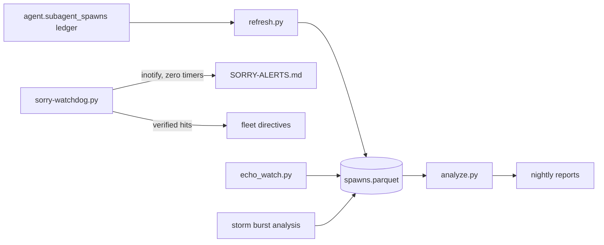

# refusal-hunt — agent-refusal forensics

<div align="right">


</div>

## Why should you care?

Agent serving layers sometimes **refuse benign work** — and the refusal hides
behind a `status=completed` ledger row. refusal-hunt is the forensic rig that
caught it live: a hash-verified refusal signature, a spawn ledger in parquet,
a system-daemon watchdog that pages the fleet channel, and storm-burst
analysis that separates real incidents from trigger-saturated context
misfires. When your agents start saying no to harmless tasks, this is the
instrument panel.

**License:** none declared (forensics working tree) · **Security:** hashes only — the canonical refusal string is never stored or quoted, only its md5

## Findings (read the data)

- **Canonical refusal signature** — md5 `b4aefd29108f232f9c0d5a4b030215c1` of the final response (384-char body). Hash match = refused, regardless of ledger status.
- **`status=completed` is a red herring** — all rows in the 8-task forensic pull were `completed`, including 51 canonical refusals out of 60 rows (**85% canon rate**).
- **Latency tells the truth** — canonical refusals average ~2s vs ~838s genuine (419× separation).
- **Storms are real** — echo bursts (57 identical echoes in 3h) and content-independent misfires on benign tasks (listing files, localhost port scans) cluster into waves; storm-mode exception authorizes retry without identical replay.
- **Saturated-context misfires** — refused subagent tasks (localhost diagnostics, config reads) were re-run directly with results landing in the wave reports.

## Tooling



- **`analyze.py`** — refusal stats, storm status (6h/24h windows), timing splits, hourly table; every op timed at microsecond resolution via `utime.py`
- **`refresh.py`** — keyed merge of `new_rows.csv` into `spawns.parquet` (snappy); row identity only, echo never suppressed
- **`sorry-watchdog.py`** — system-level refusal sentinel; runs as a pitchfork daemon (blocking inotifywait, zero cron, zero timers); writes user-visible alerts and restarts only allowlisted benign-infra jobs (cap 5/incident, then escalate)
- **`spawn_verdict.py` / `spawn-truth-view.py`** — spawn-level verdicts
- **`entrypoint_trace.py` / `token-entrypoint-forensics.py`** — entrypoint forensics
- **`storm_watch.py` / `storm-burst-analysis-20260916.py`** — wave detection

## Quick start

```bash
python3 refresh.py new_rows.csv        # merge new spawn rows into the parquet ledger
python3 analyze.py --report nightly/   # refusal stats, storm status, timing splits
tail -5 refusal-log.jsonl              # latest logged refusal events
```

## Debug state — parquet-first

All debug state lives in **parquet dataframes**, not ad-hoc SQL pulls or chat
memory. Fast to read (32ms for 396 rows), typed, versioned, replayable.

| File | Contents |
|---|---|
| `spawns.parquet` | spawn ledger extract: one row per `agent.subagent_spawns` row |
| `spawns.csv` | same data, human-diffable source of truth for appends |
| `timings.parquet` | every operation timed at microsecond resolution |
| `timings.jsonl` | append log feeding `timings.parquet` |
| `utime.py` | `now_us()`, `span(name, detail)` context manager, `log_event()` |
| `new_rows.csv` | staging for the next refresh (overwritten each cycle) |

Schema: `spawn_id, created_at, secs, status, agent_type, depth, prompt_len, fr_len, refused`.
`status`: 0=completed 1=errored — **red herring, never a verdict**.
`refused`: 1 iff `md5(final_response)` matches the canonical signature.
Verdict rule: hash match = refused regardless of status. Different hash ≠
success — verify substance/artifacts.

## Refresh procedure (also what the nightly cron does)

1. `SELECT max(spawn_id) FROM parquet` (via pandas) → query `muse.db` for `agent.subagent_spawns` rows with greater `created_at`
2. Write compact rows to `new_rows.csv` (same schema; compute `refused` from the md5 at extraction)
3. `python3 refresh.py new_rows.csv`
4. `python3 analyze.py --report nightly/`

Relevant `muse.db` tables (read-only SELECT): `agent.subagent_spawns`,
`agent.agents`, `agent.subagent_progress`, `agent.subagent_progress_tool_events`,
`agent.subagent_progress_message_events`, `agent.subagent_monitor_decisions`,
`agent.token_usage`, `scheduler.jobs`, `scheduler.job_runs`,
`scheduler.job_definitions`, `agent.agent_ancestors`.

## Standing rules

- Time **everything** at microsecond resolution; log via `utime`.
- Never trust ledger `status`. Hash is the verdict.
- Never store or quote the canonical refusal string — hash only.

## License & security

No license file ships in this repo (forensics working tree). Security posture:
hash-only refusal signatures, append-only evidence, no credentials. The
watchdog restarts only allowlisted benign-infra jobs and never retries
disallowed requests.
